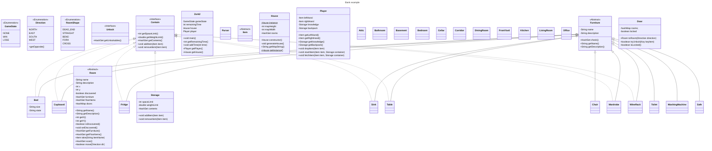

```mermaid
---
title: Bank example
---
classDiagram
    class GameState{
        <<Enumeration>>
        NONE
        WIN
        LOSE
    }

    class Direction {
        <<Enumeration>>
        NORTH
        EAST
        SOUTH
        WEST

        +getOpposite()
    }
    
    class RoomShape {
        <<Enumeration>>
        DEAD_END
        STRAIGHT
        BEND
        FORK
        CROSS
    }

    class Unlock {
        <<Interface>>
        +HashSet<Furniture> getUnlockables()
    }

    class Contain {
        <<Interface>>
        
        +int getSpaceLimit()
        +double getWeightLimit()
        +HashSet<Item> getContents()
        +void addItem(Item item)
        +void removeItem(Item item)
    }

    class Zork2 {
        GameState gameState
        int remainingTime
        House house
        Player player

        +void main()
        +int getRemainingTime()
        +void addTime(int time)
        +Player getPlayer()
        +House getHouse()
    }

    class Parser {

    }

    class Item {
        <<Abstract>>
        
    }

    class House {
        -House instance$
        -int mapHeight
        -int mapWidth
        -HashSet<Room> rooms

        -House constructor()
        -void generateHouse()
        +String getMapString()
        +House getInstance()$
    }

    class Room {
        <<Abstract>>
        -String name
        -String description
        
        -int x
        -int y
        -boolean discovered
        -HashSet<Furniture> furniture
        -HashSet<Item> floorItems
        -HashMap<Direction, Door> doors

        +String getName()
        +String getDescription()
        +int getX()
        +int getY()
        +boolean isDiscovered()
        +void setDiscovered()
        
        +HashSet<Furniture> getFurniture()
        +HashSet<Item> getFloorItems()
        +Item take(String itemName)
        +HashSet<Item> scan()
        +boolean move(Direction dir)
    }

    class Storage {
        -int spaceLimit
        -double weightLimit
        -HashSet<Item> contents
        
        +void addItem(Item item)
        +void removeItem(Item item)
    }

    class Player {
        -Item leftHand
        -Item rightHand
        -Storage knowledge
        -Storage backpack
        
        +Item getLeftHand()
        +Item getRightHand()
        +Storage getKnowledge()
        +Storage getBackpack()
        
        +void dropItem(Item item)
        +void stashItem(Item item, Storage container)
        +void fetchItem(Item item, Storage container)
    }

    class Attic
    class Bathroom
    class Basement
    class Bedroom
    class Cellar
    class Corridor
    class DiningRoom
    class FrontYard
    class Kitchen
    class LivingRoom
    class Office

    class Furniture {
        <<Abstract>>
        -String name
        -String description

        +HashSet<Item> check()
        +String getName()
        +String getDescription()
    }
    
    class Bed {
        -String size
        -String state
    }
    
    class Chair
    class Cupboard
    class Fridge
    class Sink
    class Table
    class Toilet
    class Wardrobe
    class WashingMachine
    class WineRack
    class Safe

    class Door {
        -hashMap<Direction, Room> rooms;
        -boolean locked

        +Room toRoom(Direction direction)
        +boolean tryUnlock(Key keyItem)
        +boolean isLocked()
    }
    
    Furniture <|-- Bed
    Furniture <|-- Chair
    Furniture <|-- Cupboard
    Furniture <|-- Fridge
    Furniture <|-- Sink
    Furniture <|-- Table
    Furniture <|-- Toilet
    Furniture <|-- Wardrobe
    Furniture <|-- WashingMachine
    Furniture <|-- WineRack
    Furniture <|-- Safe
    
    Contain <|.. Bed
    Contain <|.. Cupboard
    Contain <|.. Fridge
    Contain <|.. Sink
    Contain <|.. Table
    Contain <|.. Wardrobe
    Contain <|.. WineRack
    Contain <|.. Room
    Contain <|.. Storage
```