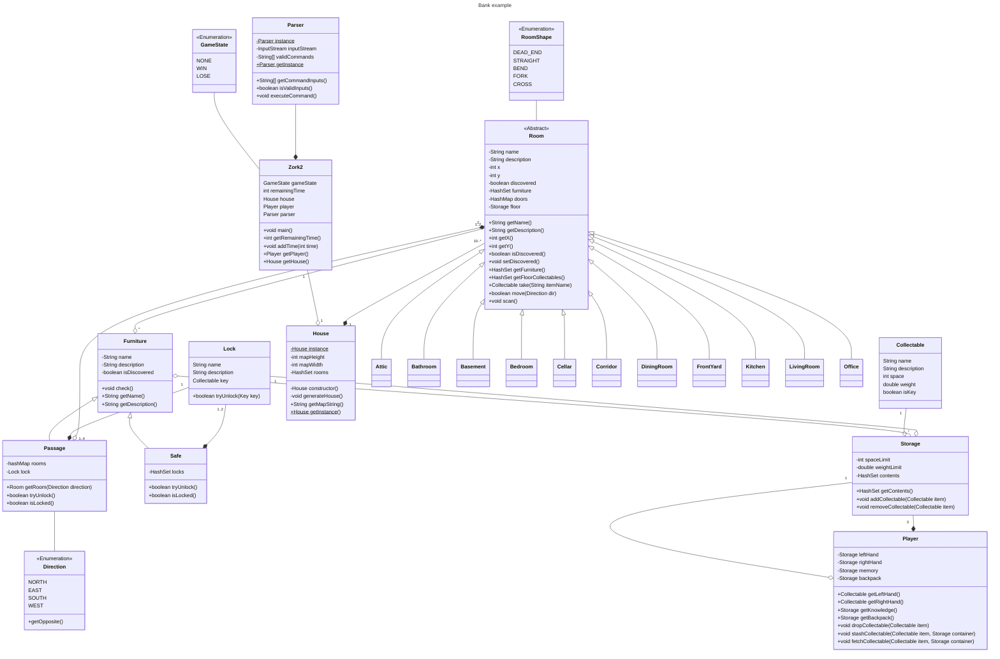

```mermaid
---
title: Bank example
---
classDiagram
    class GameState{
        <<Enumeration>>
        NONE
        WIN
        LOSE
    }

    class Direction {
        <<Enumeration>>
        NORTH
        EAST
        SOUTH
        WEST

        +getOpposite()
    }
    
    class RoomShape {
        <<Enumeration>>
        DEAD_END
        STRAIGHT
        BEND
        FORK
        CROSS
    }

    class Zork2 {
        GameState gameState
        int remainingTime
        House house
        Player player
        Parser parser

        +void main()
        +int getRemainingTime()
        +void addTime(int time)
        +Player getPlayer()
        +House getHouse()
    }

    class Parser {
        -Parser instance$
        -InputStream inputStream
        -String[] validCommands
        
        +Parser getInstance$
        +String[] getCommandInputs()
        +boolean isValidInputs()
        +void executeCommand()
    }
    
    class Lock {
        String name
        String description
        Collectable key

        +boolean tryUnlock(Key key)
    }

    class Collectable {
        String name
        String description
        int space
        double weight
        boolean isKey
    }

    class Storage {
        -int spaceLimit
        -double weightLimit
        -HashSet<Collectable> contents

        +HashSet<Collectable> getContents()
        +void addCollectable(Collectable item)
        +void removeCollectable(Collectable item)
    }

    class Player {
        -Storage leftHand
        -Storage rightHand
        -Storage memory
        -Storage backpack

        +Collectable getLeftHand()
        +Collectable getRightHand()
        +Storage getKnowledge()
        +Storage getBackpack()

        +void dropCollectable(Collectable item)
        +void stashCollectable(Collectable item, Storage container)
        +void fetchCollectable(Collectable item, Storage container)
    }

    class Furniture {
        -String name
        -String description
        -boolean isDiscovered

        +void check()
        +String getName()
        +String getDescription()
    }

    class Safe {
        -HashSet<Lock> locks

        +boolean tryUnlock()
        +boolean isLocked()
    }

    class Passage {
        -hashMap<Direction, Room> rooms
        -Lock lock

        +Room getRoom(Direction direction)
        +boolean tryUnlock()
        +boolean isLocked()
    }

    class House {
        -House instance$
        -int mapHeight
        -int mapWidth
        -HashSet<Room> rooms

        -House constructor()
        -void generateHouse()
        +String getMapString()
        +House getInstance()$
    }

    class Room {
        <<Abstract>>
        -String name
        -String description
        
        -int x
        -int y
        -boolean discovered
        -HashSet<Furniture> furniture
        -HashMap<Direction, Door> doors
        -Storage floor

        +String getName()
        +String getDescription()
        +int getX()
        +int getY()
        +boolean isDiscovered()
        +void setDiscovered()
        
        +HashSet<Furniture> getFurniture()
        +HashSet<Collectable> getFloorCollectables()
        +Collectable take(String itemName)
        +boolean move(Direction dir)
        +void scan()
    }

    class Attic
    class Bathroom
    class Basement
    class Bedroom
    class Cellar
    class Corridor
    class DiningRoom
    class FrontYard
    class Kitchen
    class LivingRoom
    class Office

    GameState -- Zork2
    Parser --* Zork2
    Zork2 "1" --o "1" House

    Player *-- "3" Storage
    Storage "1" --o Player
    
    Collectable "1" --o "*" Storage

    Furniture <|-- Safe
    Furniture o-- Storage
    Furniture <|-- Passage

    Lock "1..2" --* Safe
    Lock "1" --* Passage
    Lock "1" --o Storage

    Passage -- Direction
    Room "2" *--o "1..4" Passage
    
    RoomShape -- Room
    Room "10..*" --* "1" House
    Room "1..2" --o "*" Furniture

    Room <|-- Attic
    Room <|-- Bathroom
    Room <|-- Basement
    Room <|-- Bedroom
    Room <|-- Cellar
    Room <|-- Corridor
    Room <|-- DiningRoom
    Room <|-- FrontYard
    Room <|-- Kitchen
    Room <|-- LivingRoom
    Room <|-- Office
```